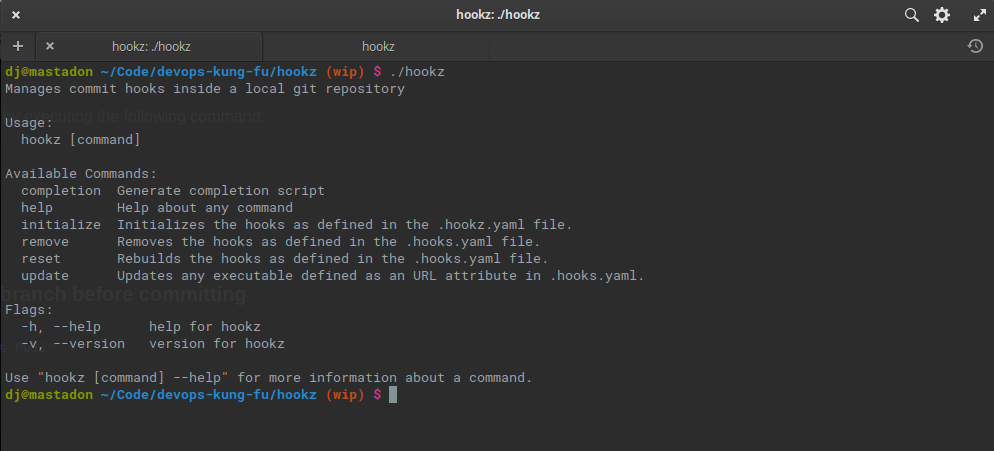

# hookz

[](https://goreportcard.com/report/github.com/devops-kung-fu/hookz)


Manages commit hooks inside a local git repository based on a configuration.



## Installation

To install hookz,  [download the latest release](https://github.com/devops-kung-fu/hookz/releases) , make is executable, rename it to _hookz_ and toss it in your ```/usr/local/bin``` directory for Linux, or on your path for other operating systems.

Example:

```bash
sudo chmod +x hookz-1.0.1-linux-amd64
sudo mv hookz-1.0.1-linux-amd64 /usr/local/bin/hookz
```


## Configuration

Hookz uses a configuration file to generate hooks in your local git repository. This file needs to be in the root of your repository and must be named *.hookz.yaml*

Take for example the following configuration:

``` yaml
  hooks:
  - name: "PlantUML Image Generator"
    type: pre-commit
    url: https://github.com/jjimenez/pre-plantuml
    args: ["deflate"]
  - name: "Post-Commit Echo"
    type: post-commit
    exec: dude
    args: ["Hello World"]

```

Hooks will read this configuration and create a pre-commit hook and a post-commit hook based on this yaml. 

The pre-commit will download the binary from the defined URL and configure the pre-commit to execute the command with the defined arguments before a commit happens.

The post-commit in this configuration will execute a command named "dude" with the arguments "Hello World" after a commit has occurred. Note that the _dude_ command must be on your path. If it isn't this post-commit will fail because the command isn't found.

## Support for multiple commands in a hook

If multiple hooks are defined in the configuration with the same type (ie: pre-commit) they will be configured to run in the order they appear in the file. There is no need to group types together, they will be written to the appropriate hooks.

## Hook types

Hook types that will execute are the same as supported by _git_. Examples are as follows:

* applypatch-msg
* commit-msg
* fsmonitor-watchman
* post-commit
* post-update
* pre-applypatch
* pre-commit
* pre-update
* prepare-commit-msg
* pre-push
* pre-rebase
* pre-receive
* update

## Return Codes

Any non-zero return code from a command executed in a hook will return a FAIL.

## Running Hookz

To generate the hooks as defined in your configuration simply execute the following:

``` bash
hookz initialize # you can also use the init alias
```

Removing hooks can be done by executing the following command:

``` bash
hookz remove
```

## Verbose option

The initialize (init) and reset command optionally take a verbosity flag to indicate extended output should be displayed when a hook executes. This is handy for debugging or seeing errors that may be suppressed by hookz.

```
hookz init --verbose
hookz reset --verbose
```
## Example Hooks

### Update all go modules to the latest version before committing

```yaml
  - name: "Update all go dependencies to latest"
    type: pre-commit
    exec: go
    args: ["get", "-u", "./..."]
```

### Pull from your remote branch before committing

``` yaml
  - name: "Git Pre-Commit Pull"
    type: pre-commit
    exec: git
    args: ["pull"]
```

