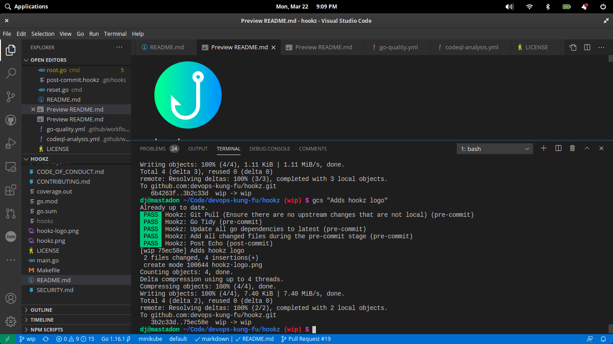
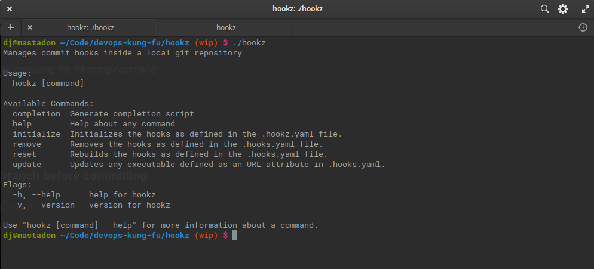

# hookz

 [](https://goreportcard.com/report/github.com/devops-kung-fu/hookz) [](https://codecov.io/gh/devops-kung-fu/hookz)

Manages git hooks inside a local git repository based on a configuration.

## Overview

Have you ever wanted to integrate custom functionality into your code commit and push workflows without using IDE plugins, hacks, or gnarly scripts? We have, and that's why we developed ```Hookz```. ```Hookz``` allows us to do a ton of commit tasks _before_ our code even hits our branches. As you commit and push code to a git based source repository, Hookz will trigger scripts, run tasks, or do just about anything for you.

The best thing? We don't care what IDE you use to develop, what your back end source control system is, or what languages you program in. Operating System? We don't care. We wrote this in Go and have compiled it for every OS and architecture you'd ever want.

Here's what happens when we use ```hookz``` on ```Hookz``` itself:



## So what exactly are Git Hooks?

Git hooks are a great way to run supplemental commands as you interact with git. For deeper information, check out what git-scm has to say about [hooks](https://git-scm.com/book/en/v2/Customizing-Git-Git-Hooks)

## What Hookz Does

```Hooks``` generates scripts from a configuration that get triggered when interacting with git locally. For example, in a pre-commit you could lint your code, test it, and then add any modifications of files into the commit before pushing it to your remote. As seen in the screenshot above, tasks come back with a status.

```Hookz``` may return one of three different status codes as it executes the action pipeline:

| Code | Description                                                  |
| ---- | ------------------------------------------------------------ |
| PASS | The action has successfully completed                        |
| WARN | An executable defined in the ```.hookz.yaml``` file wasn't found on the local system. In this case, the action is ignored and no attempt is made to run it. Flow will continue without an exit code of PASS or FAIL. |
| FAIL | The action has failed. Execution stops. Consider this like a build break in a CI/CD pipeline that executes on a pull request. Errors must be addressed before the code is allowed to be committed. |

## Installation

To install ```hookz```,  [download the latest release](https://github.com/devops-kung-fu/hookz/releases) , make is executable, rename it to ```hookz``` and toss it in your ```/usr/local/bin``` directory for Linux, or on your path for other operating systems.

Linux Example:

```bash
sudo chmod +x hookz-2.2.0-linux-amd64
sudo mv hookz-2.2.0-linux-amd64 /usr/local/bin/hookz
```

## Configuration

Hookz uses a configuration file to generate hooks in your local git repository. This file needs to be in the root of your repository and must be named ```.hookz.yaml```

### Example Configuration

``` yaml
version: 2.2.0
hooks:
  - type: pre-commit
    actions:
      - name: "PlantUML Image Generator"
        url: https://github.com/jjimenez/pre-plantuml
        args: ["deflate"]
      - name: "Git Pull (Ensure there are no upstream changes)"
        exec: git
        args: ["pull"]
      - name: "Go Tidy"
        exec: go
        args: ["mod", "tidy"]
  - type: post-commit
    actions:
    - name: "Post Echo"
      exec: echo
      args: ["-e", "Done!"]
  - type: pre-push
    actions:
      - name: "Add all changed files during the pre-commit stage"
        exec: git
        args: ["add", "."]
```

Hooks will read this example configuration and create a ```pre-commit``` hook and a ```post-commit``` hook based on this yaml. 

An action with an ```URL``` will download the binary from the defined URL and configure the hook to execute the command with the defined arguments before a commit happens.

The post-commit in this configuration will execute a command named "```dude```" with the arguments ```"Hello World"``` after a commit has occurred. Note that the _dude_ command must be on your path. If it isn't this post-commit will return a WARN message because the command isn't found.

__Check out the [tacklebox](tackle/README.md) for a curated collection of actions to get you up and running quickly.__

### Optional elements

You must have at least an URL, exec, or script defined in your actions. If you select one, then you shouldn't define the others in the YAML. Don't worry if you do, we have you covered and explain what happens in the following table.

|Attribute|Notes|
|---|---|
|```URL```|If this exists, then exec and script are ignored. The URL must be a link to an executable binary|
|```exec```|If this exists then URL and script are ignored|
|```script```|If this exists then URL, exec, and args are ignored|
|```args```|Optional in all cases|

### Inline scripting

Scripts can be embedded into the ```.hookz.yaml``` in multiline format such as follows:

__NOTE:__ There needs to be a \n at the end of a line if a multi-line statement exists in the ```script``` node, and special characters need to be escaped properly. 

``` yaml 
- type: pre-commit
    actions:
      - name: "Go Tidy (Recursive)"
        script: "
          #!/bin/bash \n
          echo -e Tidying all found go.mod occurrences \n
          find . -name go.mod -print0 | xargs -0 -n1 dirname |  xargs -L 1 bash -c 'cd \"$0\" && pwd && go mod tidy' \n
          "
```
If you have args flags set, they can be referenced as $1, $2, etc. in your script in a similar manner as passing parameters in. Any scripting language is supported.

### Support for multiple commands in a hook

If multiple hooks are defined in the configuration with the same type (ie: ```pre-commit```) they will be configured to run in the order they appear in the file. There is no need to group types together, they will be written to the appropriate hooks.

### Hook types

Hook types that will execute are the same as supported by _git_. Examples are as follows:

* ```applypatch-msg```
* ```commit-msg```
* ```fsmonitor-watchman```
* ```post-commit```
* ```post-update```
* ```pre-applypatch```
* ```pre-commit```
* ```pre-update```
* ```prepare-commit-msg```
* ```pre-push```
* ```pre-rebase```
* ```pre-receive```
* ```update```

### Return Codes

Any non-zero return code from a command executed in a hook will return a FAIL.

### Security

**IMPORTANT:** the ```URL``` element will download a binary, store it in your .git/hookz folder and mark it executable. It is important to ensure that **YOU KNOW THE SAFETY** of the executable that you are downloading. A more secure way is to use the ```exec``` attribute to run an application which is already locally installed, or embed a script in the ```script``` element to download and check the ```shasum``` of the file.

For additional security notes, view the [SECURITY.md](SECURITY.md)

## Running Hookz



To generate the hooks as defined in your configuration simply execute the following command in the _root of your local repository_ where the ```.hookz.yaml``` file resides:

``` bash
hookz initialize # you can also use the init alias
```

Removing hooks can be done by executing the following command:

``` bash
hookz remove
```

To re-download any file defined in an URL key:

``` bash
hookz update
```

### Applying changes to the .hookz.yaml

If there is a modification to the ```.hookz.yaml``` file in your application, you'll need to apply the changes using the following:

``` bash
hookz reset
```

### Debug option

The ```initialize``` (init) and ```reset``` command optionally take a debug flag to indicate extended output should be displayed while a hook executes. All output from any action will be displayed during the commit/push process when this flag is used to build the hooks. This is handy for debugging or seeing errors that may be suppressed by hookz. 

```
hookz init --debug
hookz reset --debug
```

### Verbose flag

If you want to see a log of what is happening when ```hookz``` executes, use the ```--verbose``` flag.

```
hookz init --debug
hookz reset --debug
```

## Tacklebox (Curated Example Actions)

We've assembled a collection of actions that you can lift into your ```.hooks.yaml``` file to add functionality to your hooks and get up and running quickly.

Check out the collection [here](tackle/README.md).

### Terraform Format and Terraform Docs

Assumes `terraform` is in your `PATH` for `fmt`. 

```yaml
version: 2.2.0
hooks:
  - type: pre-commit
    actions:
      - name: Terraform Format
        exec: terraform
        args: ["fmt"]
      - name: Terraform Docs
        url: https://github.com/terraform-docs/terraform-docs/releases/download/v0.12.1/terraform-docs-v0.12.1-linux-amd64
        args: ["markdown", "table", "--output-file", "README.md", "."]
```

`README.md` must contain the following tags where the documentation will be injected.

```html
<!-- BEGIN_TF_DOCS -->

<!-- END_TF_DOCS -->
```

### NPM

```yaml
version: 2.2.0
hooks:
  - type: pre-commit
    actions:
      - name: NPM CI
        exec: npm
        args: ["ci"]
      - name: NPM Test
        exec: npm
        args: ["test"]
```

## Software Bill of Materials

```Hookz``` uses the CycloneDx tackle to generate a Software Bill of Materials in CycloneDx format every time a developer commits code to this repository. More information for CycloneDx is available [here](https://cyclonedx.org)

The current SBoM for ```Hookz``` is available [here](hookz-sbom.json).

## Credits

A big thank-you to our friends at [Freepik](https://www.freepik.com) for the ```Hookz``` logo.