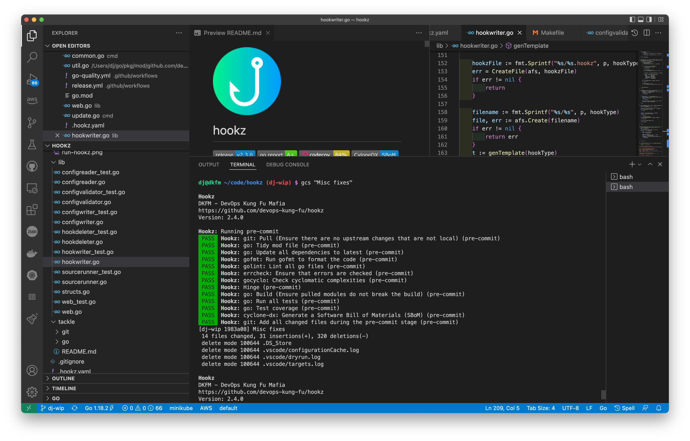

# hookz

[](https://goreportcard.com/report/github.com/devops-kung-fu/hookz) 

Manages git hooks inside a local git repository based on a configuration.

## Overview

Have you ever wanted to integrate custom functionality into your code commit and push workflows without using IDE plugins, hacks, or gnarly scripts? We have, and that's why we developed Hookz. Hookz allows us to do a ton of commit tasks _before_ our code even hits our branches. As you commit and push code to a git based source repository, Hookz will trigger scripts, run tasks, or do just about anything for you.

The best thing? We don't care what IDE you use to develop, what your back end source control system is, or what languages you program in. Operating System? We don't care. We wrote this in Go and have compiled it for every OS and architecture you'd ever want.

Here's what happens when we use Hookz on Hookz itself:



## Installation

To install hookz,  [download the latest release](https://github.com/devops-kung-fu/hookz/releases) , make is executable, rename it to _hookz_ and toss it in your ```/usr/local/bin``` directory for Linux, or on your path for other operating systems.

Linux Example:

```bash
sudo chmod +x hookz-2.0.0-linux-amd64
sudo mv hookz-2.0.0-linux-amd64 /usr/local/bin/hookz
```

## Configuration

Hookz uses a configuration file to generate hooks in your local git repository. This file needs to be in the root of your repository and must be named *.hookz.yaml*

Take for example the following configuration:

``` yaml
version: 2.0
hooks:
  - type: pre-commit
    actions:
      - name: "PlantUML Image Generator"
        url: https://github.com/jjimenez/pre-plantuml
        args: ["deflate"]
      - name: "Git Pull (Ensure there are no upstream changes)"
        exec: git
        args: ["pull"]
      - name: "Go Tidy"
        exec: go
        args: ["mod", "tidy"]
      - name: "Add all changed files during the pre-commit stage"
        exec: git
        args: ["add", "."]
  - type: post-commit
    actions:
    - name: "Post Echo"
      exec: echo
      args: ["-e", "Done!"]
```

Hooks will read this exampe configuration and create a pre-commit hook and a post-commit hook based on this yaml. 

An action with an URL will download the binary from the defined URL and configure the hook to execute the command with the defined arguments before a commit happens.

The post-commit in this configuration will execute a command named "dude" with the arguments "Hello World" after a commit has occurred. Note that the _dude_ command must be on your path. If it isn't this post-commit will fail because the command isn't found.

## Support for multiple commands in a hook

If multiple hooks are defined in the configuration with the same type (ie: pre-commit) they will be configured to run in the order they appear in the file. There is no need to group types together, they will be written to the appropriate hooks.

## Hook types

Hook types that will execute are the same as supported by _git_. Examples are as follows:

* applypatch-msg
* commit-msg
* fsmonitor-watchman
* post-commit
* post-update
* pre-applypatch
* pre-commit
* pre-update
* prepare-commit-msg
* pre-push
* pre-rebase
* pre-receive
* update

## Return Codes

Any non-zero return code from a command executed in a hook will return a FAIL.

## Running Hookz


To generate the hooks as defined in your configuration simply execute the following command in the root of your local repository where the .hookz.yaml file resides:

``` bash
hookz initialize # you can also use the init alias
```

Removing hooks can be done by executing the following command:

``` bash
hookz remove
```

To re-download any file defined in an URL key:

``` bash
hookz update
```

## Verbose option

The initialize (init) and reset command optionally take a verbosity flag to indicate extended output should be displayed when a hook executes. This is handy for debugging or seeing errors that may be suppressed by hookz.

```
hookz init --verbose
hookz reset --verbose
```
## Example Hooks

### Update all go modules to the latest version before committing

```yaml
version: 2.0
hooks:
  - type: pre-commit
    actions:
      - name: "Update all go dependencies to latest"
        exec: go
        args: ["get", "-u", "./..."]
```

### Pull from your remote branch before committing

``` yaml
version: 2.0
hooks:
  - type: pre-commit
    actions:
      - name: "Git Pre-Commit Pull"
        exec: git
        args: ["pull"]
```

## Credits

A big thank-you to our friends at [Freepik](https://www.freepik.com) for the Hookz logo.